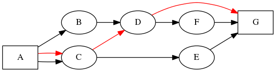

# Dublin Traceroute

### News - Blog

Dublin Traceroute now has a blog! Check it out at
[blog.dublin-traceroute.net](https://blog.dublin-traceroute.net).

### What is it?

**Dublin Traceroute is a NAT-aware multipath tracerouting tool**

Modern networks leverage [Equal-cost Multi-Path routing](https://en.wikipedia.org/wiki/Equal-cost_multi-path_routing)
for load balancing, reliability, and network capacity reasons.
Traditional traceroute may provide hard-to-interpret or even misleading results
when used in presence of ECMP routing. Tools like
[paris-traceroute](https://paris-traceroute.net) were created to address this
issue. Dublin Traceroute:
* adds a new NAT detection technique on top of that
* introduces visualization and analysis tools (via its [Python
  bindings](https://github.com/insomniacslk/python-dublin-traceroute))
* provides a modular and reusable library for easier integration.

Dublin Traceroute is released under the [2-clause BSD license](http://opensource.org/licenses/BSD-2-Clause)).


### How does it work?

Dublin Traceroute uses the techniques invented by the authors of
[Paris-traceroute](http://paris-traceroute.net) to enumerate the paths of ECMP
flow-based load balancing, and introduces a new technique for NAT detection.

The multipath enumeration is explained at
[http://paris-traceroute.net/about](http://paris-traceroute.net/about), which I
recommend to read.
In short, IP packets travelling from host A to host B may take different paths
depending on the presence of ECMP routing. Given that now there are multiple
equal-cost paths between A and B, traditional traceroute cannot force packets
through a unique path, and cannot distinguish which path each packet belongs to.

A visual example will make it easier to understand:


[[diagram source]](tr01.dot)

In the above graph you can see that there are two "first hops", namely B and C.
The same thing for the "second hops" (D and E), and a packet either traverses B
-> D -> F, or traverses C -> E -> F.
Traditional traceroute has no knowledge that a packet may traverse multiple
paths


[[diagram source]](tr02.dot)

The black arrows in the above graph indicate the possible network paths, the red
arrows show a possible path that traditional traceroute may show you instead of the
correct ones.

It gets worse when two equal-cost paths have different lengths:


[[diagram source]](tr03.dot)

The team who created Paris-traceroute invented a technique that leverages the ECMP
flow hashing to probe all the possible paths. Dublin Traceroute does what
Paris-traceroute can do, plus a bit more.

### So, what's new?

Three things:

**It can detect NATs.**
Dublin Traceroute can detect whether a traceroute is traversing NATs. For
example, if your home router hides your network behind a NAT, Dublin Traceroute
will detect that, and will also detect other NATs that are being traversed (e.g.
your ISP's CGNAT).

To detect NATs, Dublin Traceroute forges a custom IP ID in the outgoing packets,
and keeps track of them in the response packets.
If the response packet references an outgoing packet with different
source/destination IP addresses and ports, this may indicate the presence of a
NAT. In that case, the packet referenced in the response will be different from
the one that was sent, and cannot be correlated anymore. However, the IP ID is
expected to be unchanged (thanks to the presence of the `don't-fragment` bit), and
it will contain a value to correlate it to one of the outgoing packets.

Note that this technique is different from Steven Bellovin's
[A technique for Counting NATted Hosts](https://www.cs.columbia.edu/~smb/papers/fnat.pdf).

At the best of my knowledge, there is no prior technique like this. If I am wrong,
please let me know so that I can give credit where due.


**It is modular and reusable.**
Dublin Traceroute is implemented as a library and a command-line tool, making it
easy to reuse in your projects.
The results are encoded in JSON format, so you can easily integrate them in your
own application.

The core library and CLI are written in C++1, using the beautiful network packet library
[libtins](https://libtins.github.io).

If you prefer to use Python, or if you need graphical visualization and data
analysis, you can use [the Python bindings](https://github.com/insomniacslk/python-dublin-traceroute).

There is also a Go implementation in this repository, which I use for
experimentation. The Go implementation has feature parity with the C++ one, and
adds IPv6 UDP support. However the C++ implementation is the main one, and
every new feature will be eventually backported to it.

**It supports certain types of broken NATs.**
Dublin Traceroute is able to work with some broken NATs that some hosting providers use
( ~~e.g. I found that Scaleway does that~~ update: they fixed it, see https://github.com/insomniacslk/dublin-traceroute/issues/28).
When you run through this kind of NAT, you will see that neither traditional traceroute
nor paris-traceroute show responses beyond that point, even if those response packets
arrived back.

See the [examples](examples.md) to see Dublin Traceroute at work.

### Why?

Paris-traceroute is a nice tool, and the research behind it is really cool. The
implementation is a good proof-of-concept, but I needed more.

It all started as an excuse to learn more about C++11. Then I found libtins, so I
decided to write a C++11 implementation of paris-traceroute. I wanted it to
be flexible, expressive and simple to understand.

## Examples

Below the graphical output of a traceroute to Google's public DNS, 8.8.8.8. You can see the various
paths, the NAT detecton and the ICMP codes of the received packets.


See the [examples](examples.md) page for more examples on the command-line tool and the C++ and Python libraries.

## Objectives

Dublin Traceroute aims to be:

* fast
* easy to use
* multi-language (currently C++ and Python, plus a parallel Go
  implementation)
* multi-platform: any system with a reasonable C++11 or Go compiler will work
* accurate: the reported paths should be as close as possible to the reality
* visual: it can generate diagrams from the traceroute data
* robust: no memory leaks, no crashes
* usable in larger systems
* business-friendly from the licensing point of view (it is released under the
  [2-clause BSD license](http://opensource.org/licenses/BSD-2-Clause))

## Feature matrix

There are three code bases, one in C++, one in Go, and one in Python. Why so
many? Originally, `dublin-traceroute` was written in C++11. Then I added Python
bindings to simplify the generation of the dot file for graphical output, and to
allow Pandas support for statistical analysis.
Later on I realized that the C++ implementation was limiting the speed of
development of `dublin-traceroute`, so I gave it a try with Go. A basic
implementation took one afternoon, and a few more days to make it 100%
compatible with the C++ one, and to implement IPv6 probes. This suggested that
the Go implementation could become the primary one in the future. However Go
binaries are far larger than C++ ones, which is an issue on memory-constrained
devices, so the switchover is not going to happen soon.

The matrix below compares the features of each implementation. Remember that the
Python bindings add features on top of the C++ library.

|     | C++ cli/lib | Python bindings | Go cli |
| --- | --- | --- | --- |
| IPv4/UDP probe | yes | yes (using C++ lib) | yes |
| IPv6/UDP probe | no | no (depends on C++ lib) | yes |
| IPv4/TCP probe | no | no (depends on C++ lib) | no |
| IPv6/TCP probe | no | no (depends on C++ lib) | no |
| IPv4/ICMP probe | no | no (depends on C++ lib) | no |
| IPv6/ICMP probe | no | no (depends on C++ lib) | no |
| JSON output | yes | yes (depends on C++ lib) | yes |
| DOT output | yes | yes (depends on C++ lib) | yes |
| PNG output | no (done in Python bindings) | yes | no (done in Python bindings) |
| Statistical analysis | no (done in Python bindings) | yes (using Pandas) | no (done in Python bindings, might switch to go-gota) |
| Multi-platform | no (Linux-only, macOS breaks at every major release) | yes (where Python runs, and Linux-only if using traceroute functionalities) | yes (Linux, macOS tested, might work on others) |
| Can be used as a library | yes | yes | no |
| Linking | dynamic | dynamic | static |
| Size | ~650kb libdublintraceroute + 700kb libtins (+ optional libpcap) | ~450kb Python lib + 650kb C++ lib | ~4MB static binary |
| Depends on libpcap | yes if libtins is compiled with libcap support | yes if libtins is compiled with libpcap support | no |


## Installation instructions

### From packages

Dublin Traceroute is packaged in several Linux distributions.

**Debian, Ubuntu, or any other Debian-based system**
```
apt install dublin-traceroute
```

https://tracker.debian.org/pkg/dublin-traceroute
https://packages.ubuntu.com/search?keywords=dublin-traceroute


**ArchLinux**
```
pacman install dublin-traceroute
```

https://aur.archlinux.org/packages/dublin-traceroute/

**Fedora, RedHat, CentOS**

Use the `teknoraver/networking` COPR at https://copr.fedorainfracloud.org/coprs/teknoraver/networking/

Then `yum update` and `yum install dublin-traceroute` (replace with `dnf` where
relevant).


### From source

Independently of the OS, to build dublin-traceroute you need:
  * cmake
  * gcc >= 4.9 or clang >= 3.8

#### On Linux

* Install [libtins](https://github.com/mfontanini/libtins) 3.4+ from source
* Install [jsoncpp](https://github.com/open-source-parsers/jsoncpp) from source
* Install libpcap-dev
* Check out dublin-traceroute on github

```shell
git clone https://github.com/insomniacslk/dublin-traceroute.git
```

* Build it

```bash
cd dublin-traceroute
mkdir build
cd build
cmake ..
make
```

#### On macOS

You need the latest XCode installed to build this project. Then run:
```bash
brew install https://raw.githubusercontent.com/insomniacslk/dublin-traceroute/master/homebrew/dublin-traceroute.rb
```

This will be as simple as `brew install dublin-traceroute` after https://github.com/Homebrew/homebrew/pull/50000 will be merged.

Please [file an issue](https://github.com/insomniacslk/dublin-traceroute/issues/new/choose) with the necessary details if this doesn't work for you.


### On Windows

Windows is not supported at this stage. If you are willing to port
`dublin-traceroute` on Windows, please do!

#### Installing

* Install it in the system paths (by default under
/usr/local/{bin,lib,include}). This will also install the provided __libtins__
shared library and headers.

```bash
make install # as root
```

Note that if `setcap` is found when installing, it is used to set the
`CAP_NET_RAW` capability on the `dublin-traceroute` binary.
This allows any regular user to run `dublin-traceroute` without root privileges
but to be still able to use raw sockets, necessary to forge the traceroute packets.
If ```setcap``` is not found, the set-uid bit is set. If you don't want any of these,
you have to run it as root.

### Other hints

It will use your default compiler. Alternatively, if you prefer, you can force a
different compiler. For GCC:

```bash
CXX=g++ make
```

or for clang:

```bash
CXX=clang++ make
```

## Running

`dublin-traceroute` requires raw sockets. This means that you should need the `CAP_NET_RAW` capability set (see `setcap(8)`). Alternatively you can run it as root, but this is not recommended, and `dublin-traceroute` will print a warning.

The usage is very simple, and explained in the help message:

```bash
$ ./dublin-traceroute --help
Dublin Traceroute v0.3.3
Written by Andrea Barberio - https://insomniac.slackware.it

Usage:
  dublin-traceroute <target> [--sport=SRC_PORT]
                             [--dport=dest_base_port]
                             [--npaths=num_paths]
                             [--min-ttl=min_ttl]
                             [--max-ttl=max_ttl]
                             [--delay=delay_in_ms]
                             [--broken-nat]
                             [--help]
                             [--version]

Options:
  -h --help                     this help
  -v --version                  print the version of Dublin Traceroute
  -s SRC_PORT --sport=SRC_PORT  the source port to send packets from
  -d DST_PORT --dport=DST_PORT  the base destination port to send packets to
  -n NPATHS --npaths=NPATHS     the number of paths to probe
  -t MIN_TTL --min-ttl=MIN_TTL  the minimum TTL to probe
  -T MAX_TTL --max-ttl=MAX_TTL  the maximum TTL to probe. Must be greater or equal than the minimum TTL
  -D DELAY --delay=DELAY        the inter-packet delay
  -b --broken-nat               the network has a broken NAT configuration (e.g. no payload fixup). Try this if you see fewer hops than expected


See documentation at https://dublin-traceroute.net
Please report bugs at https://github.com/insomniacslk/dublin-traceroute
Additional features in the Python module at https://github.com/insomniacslk/python-dublin-traceroute
```

## Running via Docker

You can see dublin-traceroute at work using the docker image [`insomniacslk/dublin-traceroute`](https://cloud.docker.com/u/insomniacslk/repository/docker/insomniacslk/dublin-traceroute).

Just run:

```
docker run --rm -v "$PWD/output:/output" insomniacslk/dublin-traceroute
```

This will run `dublin-traceroute 8.8.8.8` and produce output files in the `output` directory.

## What is missing?

At the moment, a lot of things, including:

* ~~let the user choose the source port~~
* ~~improve the the command-line tool by adding more arguments~~ done in [commit 8a3ae75](https://github.com/insomniacslk/dublin-traceroute/commit/8a3ae7513645afdad5eabd8d6f368383dff98c8b)
* introduce more tracerouting strategies: at the moment it sends all the packets at once
* send more than one packet per hop (traceroute sends 3 packets per hop)
* ~~support MPLS~~ done in https://github.com/insomniacslk/dublin-traceroute/issues/6
* IPv6 probes in the C++ library (already implemented in the Go codebase)
* support for TCP, ICMP, and DNS probes
* add Path MTU Discovery to detect latencies introduced by fragmentation
* improve the documentation
* ~~improve the build system (there is just a static Makefile now)~~ done in [commit ffa9d3c](https://github.com/insomniacslk/dublin-traceroute/commit/ffa9d3c306fb772e2c95963a94cdc386b0126206), using CMake

See [TODO.md](TODO.md) for more details.

## FAQ

#### Why the name Dublin Traceroute?

[Paris-traceroute](http://paris-traceroute.net) was named after the french capital
since the research and the development happened there. In my case, it happened in
the city where I live and work, **Dublin**, hence the name.

#### You say this is your first C++ project. Is this an excuse to say that the code sucks?

Yes.

#### How do I ask a question or contribute?

Go to the [Dublin Traceroute mailing list](https://groups.google.com/forum/#!forum/dublin-traceroute) or to IRC, #dublin-traceroute @ FreeNode, and just ask :)

Otherwise you can [open an issue](https://github.com/insomniacslk/dublin-traceroute/issues) or [make a pull request](https://github.com/insomniacslk/dublin-traceroute/pulls) on the GitHub page of dublin-traceroute, or contact me directly (see below).

#### What is the license of Dublin Traceroute?

The [2-clause BSD](http://opensource.org/licenses/BSD-2-Clause)

#### Who are you?

My name is Andrea Barberio, you can find more about me at
https://insomniac.slackware.it
