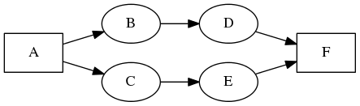
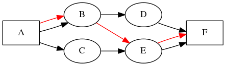
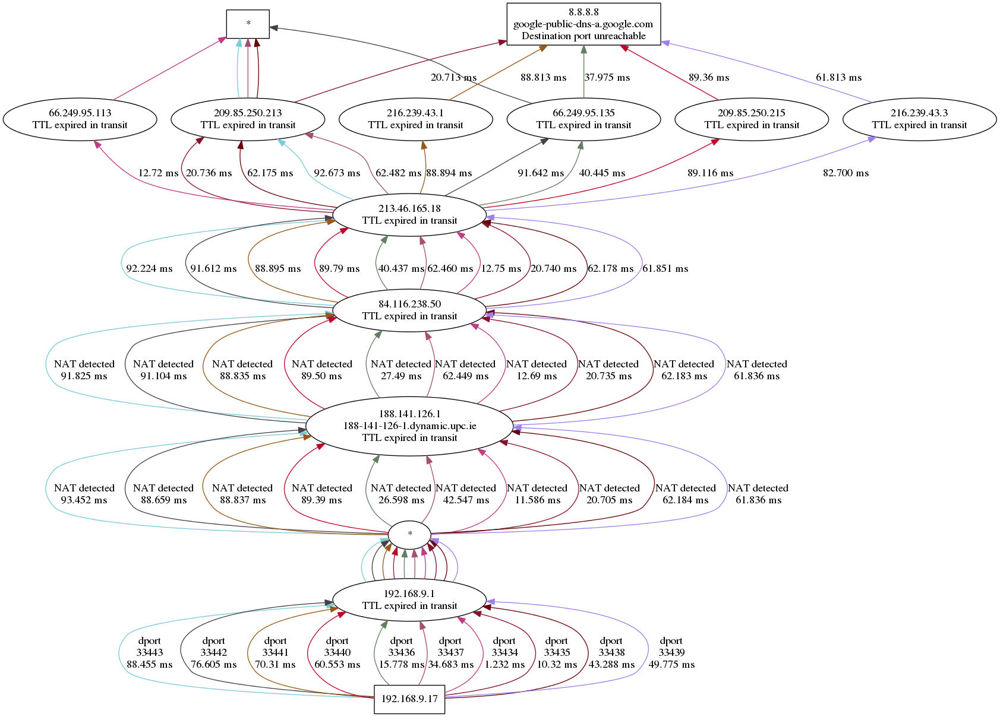

# Dublin Traceroute

### What is it?

**Dublin Traceroute is a NAT-aware multipath tracerouting tool**

### Again.. what?

You know, networks are way more complex now than years ago, and there can be
multiple paths between two network entities (like your phone, your laptop,
some remote server, etc). This way of routing packets is called
[ECMP](https://en.wikipedia.org/wiki/Equal-cost_multi-path_routing),
or Equal-Cost MultiPath, and is used to increase the capacity and the
reliability of a network.  
Running a regular traceroute in an ECMP-enabled network can cause headache, so
tools like [paris-traceroute](http://paris-traceroute.net) exist.

### How does it work?

Dublin Traceroute uses the techniques invented by the authors of
[Paris-traceroute](http://paris-traceroute.net) to enumerate the paths of ECMP
flow-based load balancing, but introduces a new technique for NAT detection.

For what matters the multi-path enumeration, there is a nice explanation on
[Paris-traceroute's about page](http://paris-traceroute.net/about). In short,
anyway, an IP packet travelling between two hosts may take different paths
depending on whether (and how) the intermediate routers implement load
balancing. This load balancing, as mentioned above, is called ECMP.
The problem with ECMP and traceroute is that a regular traceroute cannot tell
which path an hop corresponds to.
A visual example will make it easier to understand:

  
[[diagram source]](tr01.dot)

In the graph above it's easy to see that there are more than one "second hop" or
"third hop" and so on. A regular traceroute is not able to force all the packets
throuh the same path, so it may traverse the paths in an irregular way, for
example:

  
[[diagram source]](tr02.dot)

The black links are the possible paths, the red link is what a regular
traceroute may see.

This is of course wrong. It gets ever worse when two equal cost paths have
different lengths:

  
[[diagram source]](tr03.dot)

The team who created Paris-traceroute invented a technique that leverages the ECMP
flow hashing to probe all the possible paths. Dublin Traceroute does what
Paris-traceroute can do, plus a bit more.

### So, what's new?

Three things:

**One is the way NATs are detected.**  
Dublin Traceroute forges the IP ID **in the probe packet** and analyzes the
responses in order to detect all the encountered NATs.
This is a new algorithm, not found in other network mapping
solutions, despite the IP ID is not new for NAT-related tasks.
For example, Paris-traceroute uses the IP ID to tell whether a loop in a traceroute
is due to a NAT box, using the IP ID **of the response packet** as explained by
Steven Bellovin in his paper
[A technique for Counting NATted Hosts](https://www.cs.columbia.edu/~smb/papers/fnat.pdf).

I make this distinction because you may claim that Paris-traceroute already
detects NAT boxes, but this is actually very different: Paris-traceroute can
tell you whether a hop that appears as a loop in a traceroute is due to NAT,
while Dublin Traceroute can tell you whether there is a NAT after a given point,
and can also identify multiple NATs.
At the best of my knowledge, there is no tool nor public research using this
technique. If I am wrong, please let me know so that I can give the credit where
due.


**The second is that it is a modular rewrite.**  
Dublin Traceroute is written in C++11 on top of a beautiful network packet sniffing and
crafting library, [libtins](https://libtins.github.io).
Dublin Traceroute also features a Python extension on top of the C++ core if you
prefer. The bindings now live in a separate repository, see
[python-dublin-traceroute](https://github.com/insomniacslk/python-dublin-traceroute) .

**The third is that it supports broken NATs.**
Dublin Traceroute is able to work with some broken NATs that some hosting providers use
(e.g. I found that Scaleway does that). Neither paris-traceroute nor regular traceroute
would work with it, but it's not their fault as this is a network misconfiguration. When
you run a regular traceroute or paris-traceroute through this kind of NAT, you will see
no response from all the hops located just after these broken NAT boxes.

See the [examples](examples.md) to see Dublin Traceroute at work.

### Why?

Paris-traceroute is a nice tool, and the research behind it is really cool. The
implementation is a good proof-of-concept, but I needed more.

It all started as an excuse to learn more about C++11. My curiosity started after
finding a packet sniffing and crafting library that caught my attention. So I
decided to write a C++11 implementation of Paris-traceroute, but I wanted it to
be flexible, expressive and simple to understand. I have hence created a C++
shared library and a Python module to make it easily usable and embeddable.

## Examples

Below the graphical output of a traceroute to Google's public DNS, 8.8.8.8. You can see the various
paths, the NAT detecton and the ICMP codes of the received packets.



See the [examples](examples.md) page for more examples on the command-line tool and the C++ and Python libraries.

## Objectives

Dublin Traceroute aims to be:

* fast
* easy to use
* multi-language (currently C++ and Python, plus a command-line tool)
* multi-platform: any system with a reasonable C++11 compiler will work
* accurate
* visual: it can generate diagrams from the traceroute data
* robust: no memory leaks, no crashes
* usable in larger systems
* business-friendly from the licensing point of view (it is released under the
  [2-clause BSD license](http://opensource.org/licenses/BSD-2-Clause))

## Installation instructions

### From packages

Dublin Traceroute is packaged in Debian and Ubuntu, yet still in the testing repos. To install it (as root):

on Debian:

* enable the `testing` repository, with something like `echo "deb http://httpredir.debian.org/debian testing main" > /etc/apt/sources.list.d/debian-unstable.list`
* `apt-get install dublin-traceroute`

or alternatively without adding the repository:

`apt-get install dublin-traceroute -t testing`

on Ubuntu:

* add the `proposed` repository, following the instructions at https://wiki.ubuntu.com/Testing/EnableProposed
* `apt-get install dublin-traceroute`

on CentOS 7:

* copy the [dublin-traceroute repository configuration](dublin-traceroute.repo) to `/etc/yum.repos.d/`
* yum update
* yum install dublin-traceroute

Sorry, no GPG verification yet, and no CentOS 6 yet :(

### From source

Independently of the OS, to build dublin-traceroute you need:
  * cmake
  * gcc >= 4.9 or clang >= 3.8

#### Building on Linux

* Install [libtins](https://github.com/mfontanini/libtins) 3.4+ from source
* Install [jsoncpp](https://github.com/open-source-parsers/jsoncpp) from source
* Install libpcap-dev
* Check out dublin-traceroute on github

```shell
git clone https://github.com/insomniacslk/dublin-traceroute.git
```

* Build it

```bash
cd dublin-traceroute
mkdir build
cd build
cmake ..
make
```

#### Building on OS X

```bash
brew install https://raw.githubusercontent.com/insomniacslk/dublin-traceroute/master/homebrew/dublin-traceroute.rb
```

This will be as simple as `brew install dublin-traceroute` after https://github.com/Homebrew/homebrew/pull/50000 will be merged.

#### Installing

* Install it in the system paths (by default under
/usr/local/{bin,lib,include}). This will also install the provided __libtins__
shared library and headers.

```bash
make install # as root
```

Note that if ```setcap``` is found when installing, it is used to set the
```CAP_NET_RAW``` capability on the ```dublin-traceroute``` binary.
This allows any regular user to run ```dublin-traceroute``` without root privileges
but to be still able to use raw sockets, necessary to forge the traceroute packets.
If ```setcap``` is not found, the set-uid bit is set. If you don't want any of these,
you have to run it as root.

### Other hints

It will use your default compiler. Alternatively, if you prefer, you can force a
different compiler. For GCC:

```bash
CXX=g++ make
```

or for clang:

```bash
CXX=clang++ make
```

## Running

`dublin-traceroute` requires raw sockets. This means that you should need the CAP_NET_RAW capability set (see `setcap(8)`). Alternatively you can run it as root, but this is not recommended, and `dublin-traceroute` will print a warning.

The usage is very simple, and explained in the help message:

```bash
$ ./dublin-traceroute --help
Dublin Traceroute v0.3.3
Written by Andrea Barberio - https://insomniac.slackware.it

Usage:
  dublin-traceroute <target> [--sport=SRC_PORT]
                             [--dport=dest_base_port]
                             [--npaths=num_paths]
                             [--min-ttl=min_ttl]
                             [--max-ttl=max_ttl]
                             [--delay=delay_in_ms]
                             [--broken-nat]
                             [--help]
                             [--version]

Options:
  -h --help                     this help
  -v --version                  print the version of Dublin Traceroute
  -s SRC_PORT --sport=SRC_PORT  the source port to send packets from
  -d DST_PORT --dport=DST_PORT  the base destination port to send packets to
  -n NPATHS --npaths=NPATHS     the number of paths to probe
  -t MIN_TTL --min-ttl=MIN_TTL  the minimum TTL to probe
  -T MAX_TTL --max-ttl=MAX_TTL  the maximum TTL to probe. Must be greater or equal than the minimum TTL
  -D DELAY --delay=DELAY        the inter-packet delay
  -b --broken-nat               the network has a broken NAT configuration (e.g. no payload fixup). Try this if you see less hops than expected


See documentation at https://dublin-traceroute.net
Please report bugs at https://github.com/insomniacslk/dublin-traceroute
Additional features in the Python module at https://github.com/insomniacslk/python-dublin-traceroute
```

## What is missing?

At the moment, a lot of things, including:

* let the user choose the source port
* introduce UDP DNS probes
* ~~improve the the command-line tool by adding more arguments~~ done in [commit 8a3ae75](https://github.com/insomniacslk/dublin-traceroute/commit/8a3ae7513645afdad5eabd8d6f368383dff98c8b)
* introduce more tracerouting strategies: at the moment it sends all the packets at once
* send more than one packet per hop (traceroute sends 3 packets per hop)
* ~~support MPLS~~ done in https://github.com/insomniacslk/dublin-traceroute/issues/6
* support ECMP on IPv6
* support for TCP and ICMP probes
* add Path MTU Discovery to detect latencies introduced by fragmentation
* improve the documentation
* ~~improve the build system (there is just a static Makefile now)~~ done in [commit ffa9d3c](https://github.com/insomniacslk/dublin-traceroute/commit/ffa9d3c306fb772e2c95963a94cdc386b0126206), using CMake

See [TODO.md](TODO.md) for more details.

## FAQ

#### Why the name Dublin Traceroute?

[Paris-traceroute](http://paris-traceroute.net) was named after the french capital
since the research and the development happened there. In my case, it happened in
the city where I live and work, **Dublin**, hence the name.

#### You say this is your first C++ project. Is this an excuse to say that the code sucks?

Yes.

#### How do I ask a question or contribute?

Go to the [Dublin Traceroute mailing list](https://groups.google.com/forum/#!forum/dublin-traceroute) or to IRC, #dublin-traceroute @ FreeNode, and just ask :)

Otherwise you can [open an issue](https://github.com/insomniacslk/dublin-traceroute/issues) or [make a pull request](https://github.com/insomniacslk/dublin-traceroute/pulls) on the GitHub page of dublin-traceroute, or contact me directly (see below).

#### What is the license of Dublin Traceroute?

The [2-clause BSD](http://opensource.org/licenses/BSD-2-Clause)

#### Who are you?

My name is Andrea Barberio, you can find more about me at
https://insomniac.slackware.it
